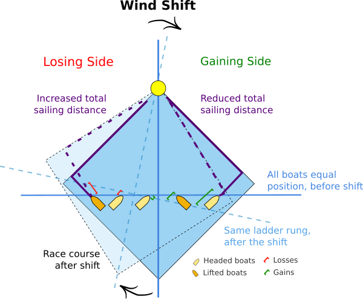

# Wind Analysis for Sailing
Software to analyzing wind for sailboat racing.

## [Lifts and Headers](lifts-and-headers/README.md) 

Is it good or bad to tack on a header?

## [Plotting Tracks](plotting-tracks/README.md)

How was your boat speed after the start?

## [Historical Wind Analysis](historical-wind/README.md)

Are there common trends in weather patterns?

