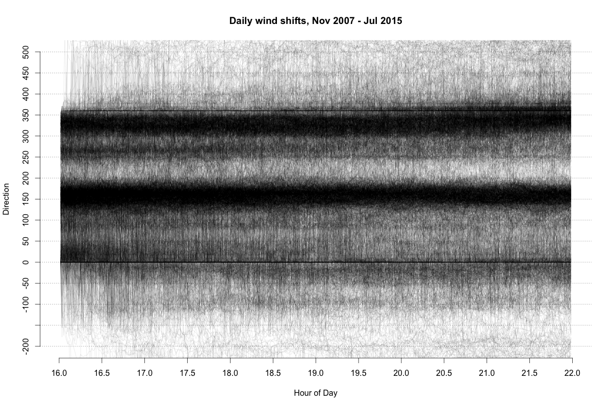
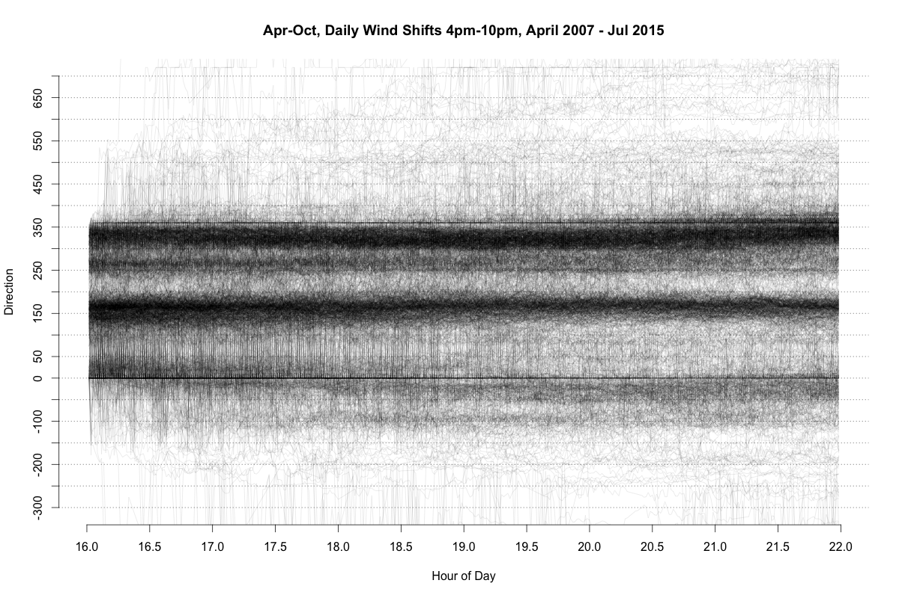
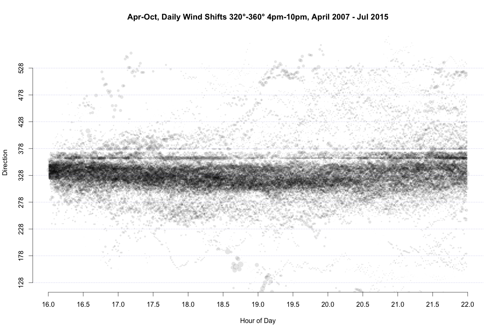
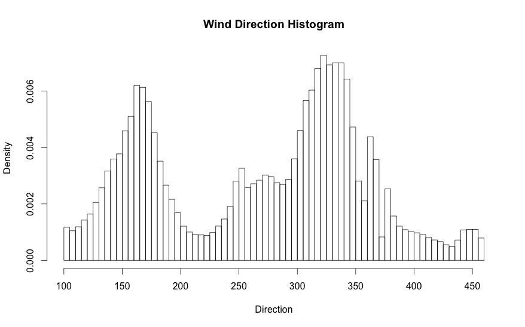
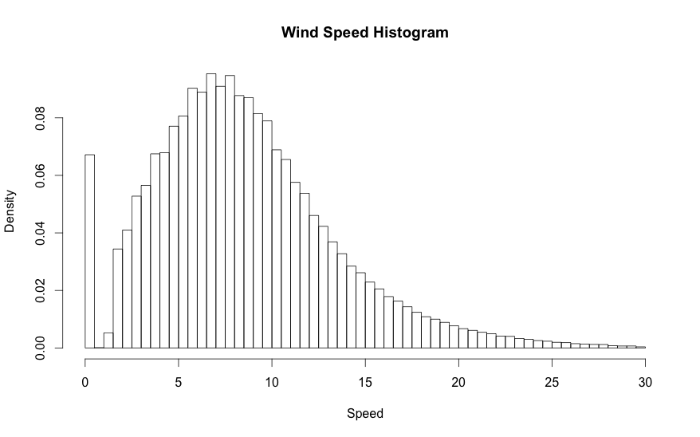

# Historical Wind Plots

This data was pulled from SR-520 floating bridge weather station which
is mid-span in the center of Lake Washington where J24 racing with CYC Seattle happens.

Plotting daily wind where each thread is the accumulation of all wind shifts.
Most obvious thing to note is the wind most commonly comes from the north or the south.

What about only during the racing season. Any change?

What about only wind originating from 320 degrees to 360 degrees? Definitely looks
like a regular left shift in the evening for northerly winds.

Most common wind direction:

Most common wind speed:

