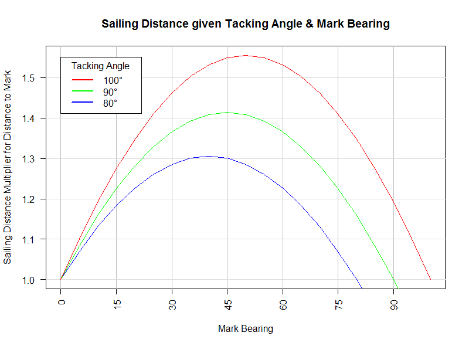
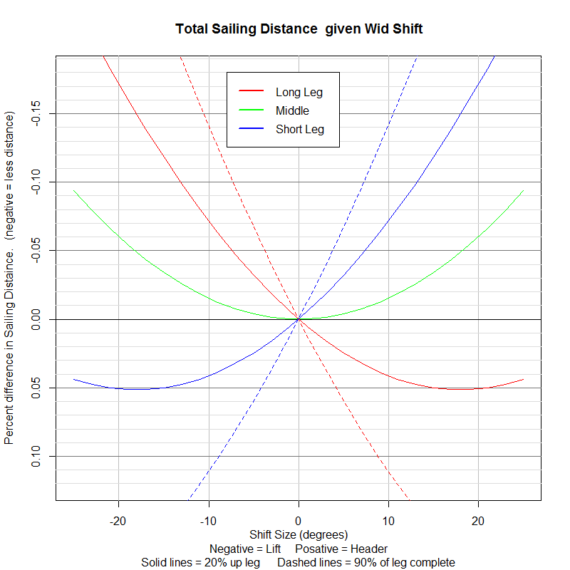

# Sailing Lifts, Headers, and Tacking Angles

In trigonometry we can solve any triange given two angles and the
length of just one leg. Here we use _bearing to the mark_, `BTM`, for
our first angle, the tacking angle for the second, `TA`, and _distance
to the mark_, `DTM`, as our side. Given these three variables we can
figure out where you are on the race course, where the corner is, and
what the total sailing distance will be.

## Total sailing distance
<!--
Imagine you were on a square race course, as you look up towards the mark
the bearing (degrees off you're bow, close-hauled), will be around 45 degrees,
or half you're tacking angle. As you climb up the course, you're
bearing to the mark will increase, and when it hits you're tacking
angle (say, 90), you tack. Now your bearing is ZERO as the mark
is straight ahead.
-->

This plot gives us a multiplier for the our distance to the mark, that
results in the total sailing distance required to reach the mark.
For any given mark bearing on the X axis, zero, meaning you are on the
layline, to your tacking angle (say 90 degree), meaning you're at the corner.
A good rule of thumb, if you're tacking angle is 90 degrees, the total
sailing distance is `1.4 * DTM` - or an extra 40%, for a square course.

The peaks of the parabolas indicate half our tacking angle, which means
we are in the center of the course. No leg is longer than another.
Here, there is a 10% reduction in the total distance you have to
travel when your tacking angle is 80 degrees vs 90 degrees.  If your
tacking angle is 100 degrees, you'll sail an extra 14% vs 90 degree
tacks. Clearly, pointing higher into the wind can give dramatic gains,
particularly over several legs.

# Distance gained/lossed during headers and lifts

This plot shows the percentage of the total sailing distance gained or
lossed for a shifts of different sizes, at different parts of the race course.

The GREEN line shows when you are exactly in the middle of the
course. IE, you have zero leverage and it doesn't matter what 
way the wind goes, _any shift will make the course shorter_.

Imagine you were on a square race course, when you are close-hauled,
as you look up towards the mark, it's bearing will be around 45
degrees, or half you're tacking angle. As you climb up the course,
you're bearing to the mark will increase, and when it hits you're
tacking angle (say, 90), you tack. Now your bearing is ZERO as the
mark is straight ahead.

Any wind shift will change our bearing to the mark. If the bearing is
say, 70 degrees, and we get a shift that's a +10 degree header, our
heading will be +10 degrees, and the new mark bearing will be 80
degrees. We are getting closer to the corner.

The *SOLID BLUE LINE* shows when you're on the *SHORT LEG* of the course,
about 20% up the first leg. On a square course, as soon as you start
the race you are on the short leg, and it gets shorter the further we
get up the course.

The *SOLID RED LINE* shows when you are on the *LONG LEG*, about 20% of
leg completed. For example, this is when course is skewed and you started on
the long leg. Or, this is when you tacked before the corner and you're
on the longer leg.

Following the SOLID BLUE LINE, for 20% up the SHORT LEG, any _increase_
in our bearing to the mark, aka, a _header_, is going to _shorten_ the
distance  travel to reach the mark. We see with a +10 degree header,
the total sailing distance is reduced by 7%, while a +20 degree header
is a 17% reduction.

While on the SHORT LEG, any LIFT will _increase_ the total sailing
distance. However, getting a lift here isn't so bad as a 10 degree
lift only increases the distance by 4%.

*Lessons:*
  - On a SQUARE course, seek HEADERS on the FIRST leg.
  - On a SKEWED course, seek HEADERS on the SHORT LEG.

The DASHED BLUE LINE, for 90% up SHORT LEG, shows that as we get
further up the race course, and our short leg becomes really short,
and we approach the corner, our _leverage increase_ significantly.
A 10 degree header now reduces the remaining sailing distance by 14%
and a 10 degree lift adds 11% to our remaining distance. This is the
_"sailing around the world"_ problem. As you get lifted, the corner
gets further away and you end up chasing the lay line.

*Lessons:*
  - Avoid the corners if increased chance of a lift.
  - Seek HEADERs early in the FIRST LEG as any possible
    lift will be less painfull.
  - If you're near the CORNER, TACK on even the smallest LIFT.
  - NEVER tack on a HEADER when you're on the SHORT LEG, especially
    near the CORNER.

If we follow the SOLID RED LINE, for 20% up the LONG LEG,
it shows that HEADERs will _increase_ the sailing distance and
LIFTs will _reduce_ the total sailing distance. A 10 degree lift on
the long leg, will reduce your sailing distance by 7%, while a 10 degree
header only increases your total distance by just 4%.

*Lessons:*
  * When the course is SKEWED and you are sailing the
    LONG TACK first, LIFTS ARE GOOD.
  * When you are on the LONG TACK you want to AVOID HEADERS.
  * On the LONG TACK - seeking lifts is more important
    than avoiding headers.

Following the DASHED RED LINE, which is 10% remaining of the LONG LEG,
the mark is just off your bow and you have a short leg remaining.
A lift will shrinks that other leg, while a header will increase it.
Here, we have become very leveraged - HEADERs are really painfull and
LIFTs look pretty good but they were worth more earlier in the leg.
A 10 degree HEADER will add 11% of the remaining sailing distance while a 10
degree LIFT reduces total distance by 14%.

*Lessons:*
  * On the LONG LEG, TACK on any HEADER near the CORNER.
  * ALWAYS tack on a HEADER on the LONG LEG, especially near CORNERS.

*Summary:* IMPORTANT things to keep in mind while racing:
  * Am I on the SHORT LEG or the LONG LEG. This is easy to tell: if
    the mark bearing is between the wind and your bow, you're on the
    LONG LEG. If the mark is _past head to wind_, (or 45 degrees,
    given a 90 degree tacking angle), but you have not reached the
    lay line, you are on the SHORT LEG.    
  * CORNERS are DANGER ZONES for UNPREDICTABLE wind shifts.
  * On a SKEWED course, sail the LONG TACK and SEEK LIFTS, or SHORT
    LEG and seek HEADERs.
  * On a SQUARE course, SEEK HEADERs on the FIRST LEG.

