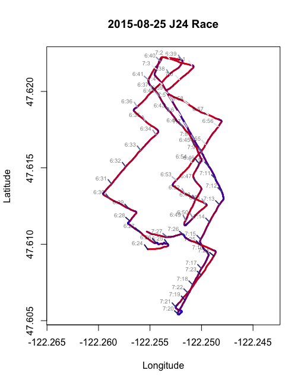
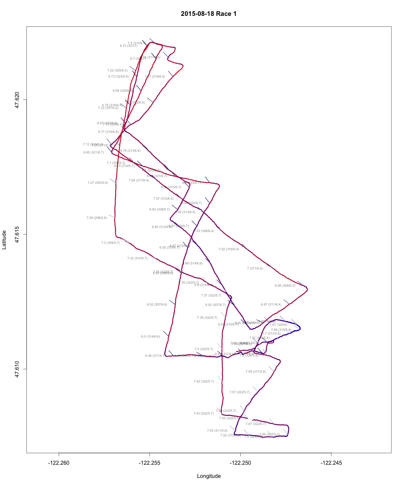

# Plotting Track for Sailboat Racing

Boat tracks are logged using AndroSensor App.
The track's color will change based on the speed of the boat.
The wind flags on the tracks come from a seperate CSV and merged with the boat
tracks. They are inline with the wind angle and also change color based on wind speed.

To run, set working directory to `plotting-tracks` and source `queries/plot_tracks.R`.
The manipulate library allows selecting the time to plot.

## Analysis
These plots are useful to determine how your boat speed is after tacking or how
long you were sailing on a bad shift. It's also useful to cross reference with 
reported wind readings to see if your boat speed slowed due to the wind.

## Sample Plots

